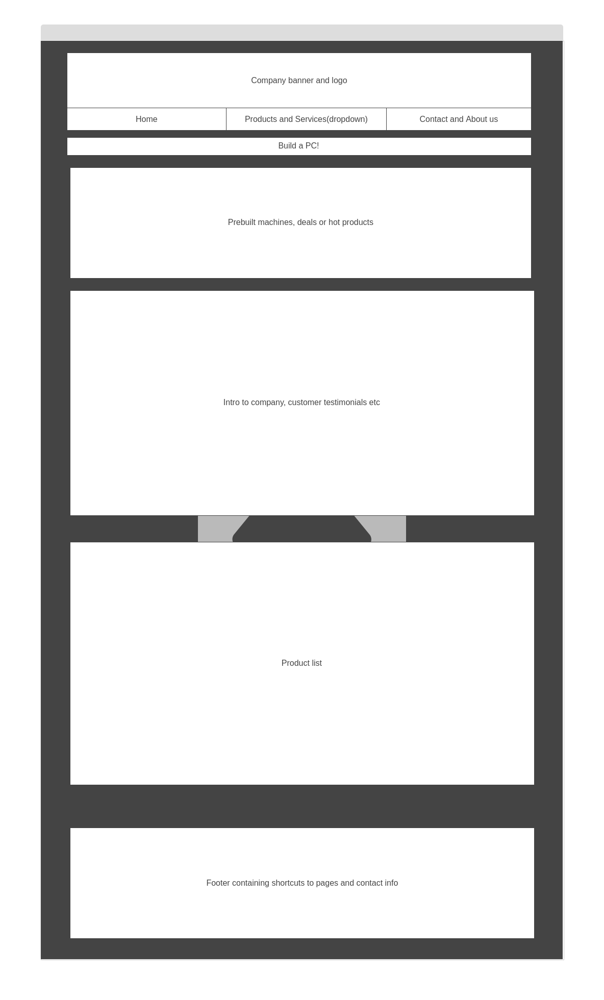
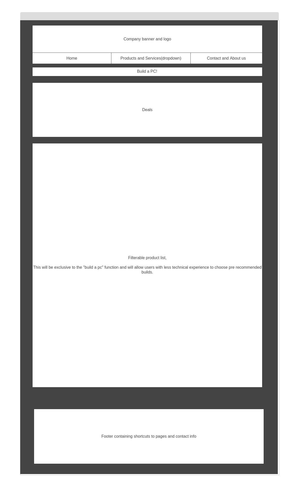
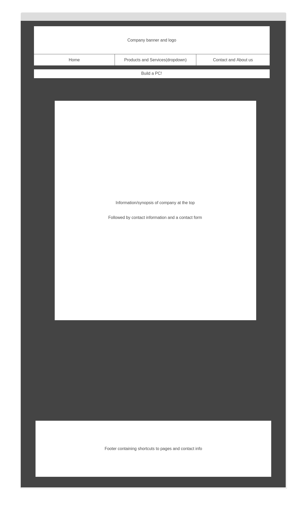
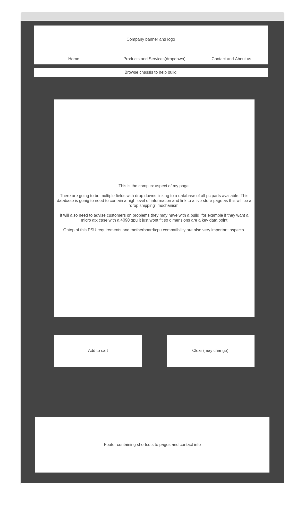

# Web-development
## Desktop Manufacturing business
# Introduction
Welcome to the Computer Manufacturing Website project! This website is designed to serve as the online presence for a modern computer manufacturing business, catering to both tech enthusiasts and professionals in need of high-quality, custom-built systems. The emphasis being on the bespoke capabilities of this company that others do not provide.

# Purpose
## The primary purpose of this project is to create a user-friendly and visually appealing platform where users can:

1. Explore a wide range of computer products and components.
2. Learn about the company's services, including custom-built PCs and technical support.
3. Easily contact the business for inquiries or assistance.
4. The website will be built with a focus on accessibility, responsiveness, and intuitive navigation, ensuring a positive experience for all users.

# Target Audience
## This website is tailored for:

1. Tech Enthusiasts: Users who are passionate about technology and are looking for detailed specifications of high-performance computers and components.
2. Businesses: Organizations in need of reliable, custom solutions for office setups or enterprise-level requirements.
3. Casual Users: Individuals seeking affordable and dependable personal computers for everyday use.

# Website Structure (Sitemap)
## The website will have the following main pages:

# Home

- Welcome message and a brief overview of the company.
- Highlights of popular products and services.
- Call-to-action buttons (e.g. “Build your PC,” “Contact Us”).

# Products

- Categories for desktops, laptops, components, and accessories.
- Product details, including specifications, pricing, and availability.
- Images and videos showcasing the products.
  
# Services

- Information about custom PC builds, repairs, and maintenance services.
- Steps for submitting requests for custom configurations.
- Testimonials from satisfied clients.

# About Us

- Company history and mission.
- Certifications, partnerships, or awards.

# Contact

- Contact form for inquiries (name, email, message).
- Business phone number, email, and address.
- Embedded map for location (Google Maps API).

# Wireframes
## Homepage

## Product Page

## Contact and Info page

## Build a PC form

